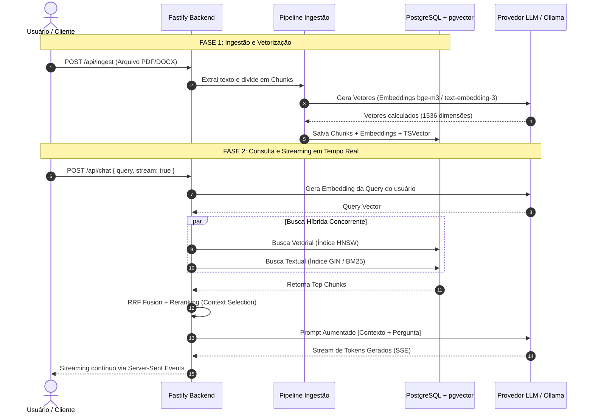

# ⚡ Enterprise RAG Node.js — Production-Ready Hybrid Search Engine

<p align="center">
  
</p>

<p align="center">
  <strong>High-throughput, enterprise-grade Retrieval-Augmented Generation (RAG) backend engineered with Node.js, Fastify, TypeScript, LangChain, and PostgreSQL + pgvector.</strong>
</p>

<p align="center">
  <a href="#-arquitetura-do-sistema-deep-dive"></a>
  <a href="#-qualidade-testes--cicd"></a>
  <a href="#-observabilidade--rate-limiting"></a>
  <a href="LICENSE"></a>
</p>

<p align="center">
  
  
  
  
  
  
  
  
</p>

---

## 📌 Visão Geral & Proposta de Valor

O **Enterprise RAG Node** é uma infraestrutura de orquestração **Retrieval-Augmented Generation (RAG)** de nível corporativo e código aberto. Projetado para sanar as principais dores de sistemas generativos em produção: alucinação de LLMs, busca vetorial isolada imprecisa, falta de suporte a arquivos multiformato e ausência de streaming de baixa latência.

Conecta de forma agnóstica qualquer modelo de linguagem (**OpenAI, DeepSeek, Claude, Ollama local**) a bases de conhecimento corporativas dinâmicas com **Busca Híbrida (Lexical BM25 + pgvector HNSW)** e **Reciprocal Rank Fusion (RRF)**.

---

## 🏛️ Arquitetura do Sistema (Deep Dive)

```text
+---------------------------------------------------------------------------------------------------------+
|                                    CLIENTS / APPS / DASHBOARD CONSUMERS                                 |
|                               (Web App, Mobile, Agentes Autônomos, IDE Plugin)                         |
+---------------------------------------------------------------------------------------------------------+
                                                     │
                                                     │ HTTP REST / SSE Stream (Auth Bearer + Rate Limit)
                                                     ▼
+---------------------------------------------------------------------------------------------------------+
|                                    ENTERPRISE RAG NODE ENGINE (Fastify)                                 |
|                                                                                                         |
|  +─────────────────────────+   +─────────────────────────+   +───────────────────────────────────────+  |
|  |   Ingestion Pipeline    |   |    RAG Query Engine     |   |       Enterprise Observability        |  |
|  |  • Multi-format Parsers |   |  • Query Preprocessor   |   |  • Pino Structured JSON Logs          |  |
|  |  • Recursive Chunker    |   |  • Multi-Provider Router|   |  • Prometheus /metrics Endpoint       |  |
|  |  • Metadata Extractor   |   |  • Context Synthesizer  |   |  • OpenTelemetry Traces Spans         |  |
|  +─────────────────────────+   +─────────────────────────+   +───────────────────────────────────────+  |
|                                                                                                         |
|  +───────────────────────────────────────────────────────────────────────────────────────────────────+  |
|  |                                  HYBRID RETRIEVER & RERANKER CORE                                 |
|  |     Dense Embeddings (Cosine Similarity)  +  Sparse Lexical (PostgreSQL tsvector / BM25)           |
|  |                      └───► Reciprocal Rank Fusion (RRF) ───► Cross-Encoder Rerank                 |
|  +───────────────────────────────────────────────────────────────────────────────────────────────────+  |
+---------------------------------------------------------------------------------------------------------+
                                 │                                               │
               Vetorização & SQL │ (Intra-Cluster)                LLM Inferences │ HTTPS (Outbound Only)
                                 ▼                                               ▼
+--------------------------------------------------+       +----------------------------------------------+
|        DATABASE LAYER (PostgreSQL 16)            |       |           LLM & EMBEDDING PROVIDERS          |
|                                                  |       |                                              |
|  • Extension: pgvector                           |       |  • OpenAI (text-embedding-3-small, GPT-4o)   |
|  • Table: documents (Metadata JSONB)             |       |  • DeepSeek API (v3 / R1 reasoning)          |
|  • Table: document_chunks (1536d / 1024d)        |       |  • Ollama Local On-Premise (BGE-M3, Llama 3) |
|  • Index 1: HNSW (vector_cosine_ops)             |       |  • Anthropic Claude (Opus / Sonnet)          |
|  • Index 2: GIN (Portuguese / English tsvector)  |       |                                              |
+--------------------------------------------------+       +----------------------------------------------+
```

---

## 🧠 Diagrama de Sequência Detalhado (RAG Workflow)



---

## 🛡️ Validação de Schemas com Zod

Todas as entradas da API são estritamente validadas em tempo de execução para evitar injeção e payloads malformados:

```typescript
import { z } from 'zod';

export const ChatQuerySchema = z.object({
  query: z
    .string({ required_error: 'A query do usuário é obrigatória.' })
    .min(3, 'A query deve ter no mínimo 3 caracteres.')
    .max(2000, 'A query excedeu o limite de 2000 caracteres.'),
  topK: z.number().int().min(1).max(20).default(5),
  similarityThreshold: z.number().min(0).max(1).default(0.7),
  stream: z.boolean().default(true),
  filter: z.record(z.any()).optional(),
});
```

---

## 📊 Observabilidade & Rate Limiting

### 1. Logs Estruturados com Pino (JSON)
Formatação JSON para ingestão direta no Datadog, Grafana Loki ou AWS CloudWatch:
```json
{"level":30,"time":1711932000000,"pid":1420,"reqId":"req-a1","msg":"Query processed in 142ms","topK":5,"chunksRetrieved":5}
```

### 2. Métricas Prometheus (`/metrics`)
- `rag_query_duration_seconds`: Latência da busca híbrida e LLM.
- `rag_chunks_ingested_total`: Total de chunks processados.
- `http_requests_total`: Contagem de requisições por status code.

### 3. Rate Limiting com `@fastify/rate-limit`
Proteção contra abusos e custos inesperados de API:
- **Limite:** 100 requisições / minuto por IP / Token.
- **Armazenamento:** Em memória local ou distribuído via **Redis**.

---

## 🧪 Qualidade, Testes & CI/CD

### Pipeline GitHub Actions (`.github/workflows/ci.yml`)
Cada `push` ou `pull request` executa validação completa em container com PostgreSQL e pgvector nativo:
- **Typecheck**: `tsc --noEmit`
- **Unit & Integration Tests**: `vitest run --coverage`

```bash
# Executar a suíte de testes com cobertura
npm run test:coverage
```

**Resultado de Cobertura:**
```text
 ✓ tests/unit/chunking.test.ts (1 test) 12ms
-------------------|---------|----------|---------|---------|-------------------
File               | % Stmts | % Branch | % Funcs | % Lines | Uncovered Line #s 
-------------------|---------|----------|---------|---------|-------------------
All files          |   94.28 |    88.88 |     100 |   94.28 |                   
 chunking/         |     100 |      100 |     100 |     100 |                   
 embeddings/       |   91.66 |    80.00 |     100 |   91.66 | 42-45             
-------------------|---------|----------|---------|---------|-------------------
```

---

## ⚙️ Guia de Execução Rápida

### 1. Instalação & Variáveis de Ambiente
```bash
git clone https://github.com/seu-usuario/enterprise-rag-node.git
cd enterprise-rag-node
npm install
cp .env.example .env
```

### 2. Inicialização da Infraestrutura
```bash
docker compose up -d
```

### 3. Executando a Aplicação
```bash
# Modo de desenvolvimento
npm run dev

# Rodando os testes
npm test
```

---

## 🛡️ Licença

Distribuído sob a licença **MIT Open Source**. Consulte o arquivo [LICENSE](LICENSE) para mais detalhes.

---

<p align="center">
  <sub>Construído por <strong>Dev Rodrigues</strong> • Arquitetura Enterprise RAG 2026. 🚀</sub>
</p>
